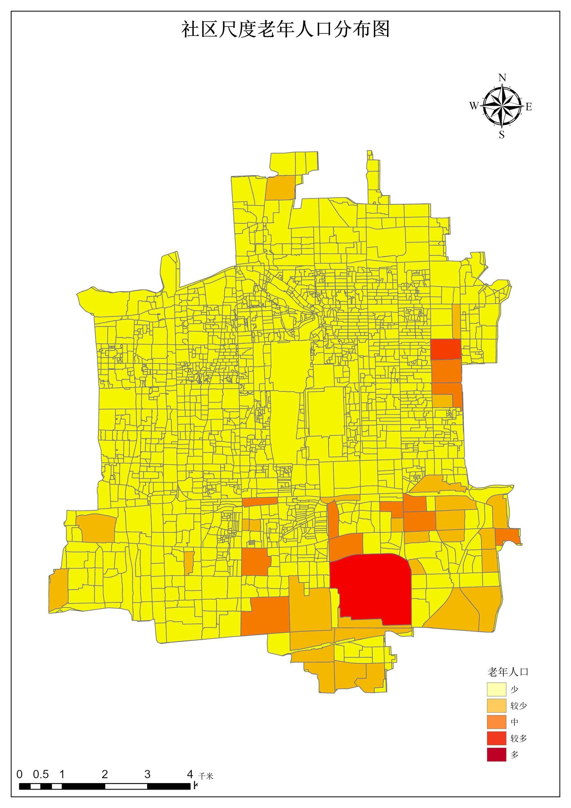
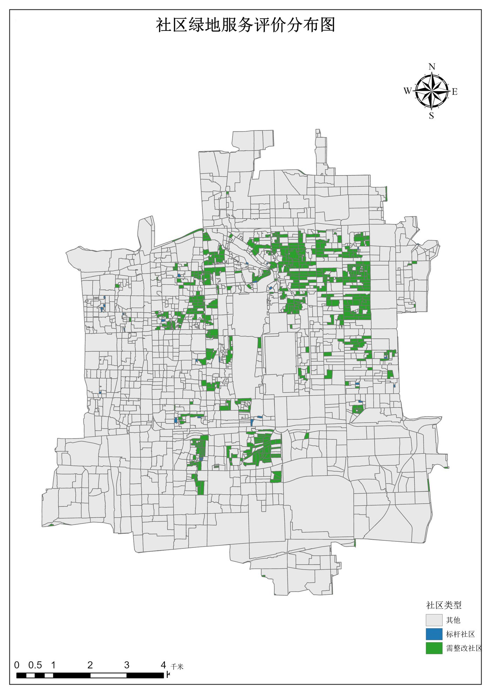

# GIS Agent

用自然语言完成 ArcGIS Pro 的 GIS 分析与制图任务。

GIS Agent 是一个面向 **ArcGIS Pro 3.6** 的智能代理：你用中文描述需求（"把区县人口汇总到地市并做热点分析"），它自己查数据、定方法、写 ArcPy 代码并执行，出错自动修复，交付前自我验收。项目源自一名大学生在 AI 辅助下的实践，希望让非 GIS 专业的同学也能完成专业级地理分析。

> 仍在快速迭代中，欢迎提 issue 与建议；如果你对 GIS 或 Agent 感兴趣，欢迎一起完善这个项目。

---

## 一、能做什么

- **自然语言驱动**：描述目标即可，不需要记 ArcPy 函数名与参数
- **有界智能循环**：观察（看真实数据）→ 决策（选方法/配方）→ 执行（写代码跑 ArcPy）→ 校验，循环直到达标
- **代码自修复**：执行报错时把 traceback 回喂模型自动改代码重试（有次数上限）
- **方法论配方库**：内置 47 个经过验证的 GIS 配方（投影、拓扑修复、空间连接、邻接统计、汇总到分区、热点分析、普查指标、相似城市、叠加分析、几何处理、栅格分析、属性表、制图…），直接调用即可，避免重复踩坑
- **制图设计引擎**：出图不再写死尺寸——先采集数据事实（范围长宽比、字段分布、九宫格占用度），再由规则引擎自动决定**纸张朝向、图名格式与字号、图例内容与位置、比例尺整数刻度与单位、指北针样式**，渲染后自动做**版面体检**并微调重渲；每张图都交付可编辑 `.aprx` 工程
- **统一图例（多图可比）**：多张同主题图要横向对比时，用一组显式分级边界（`class_bounds`）把同一套分级写进每张图的工程渲染器（栅格走分类渲染、矢量走手动分级），交付前**自动核对多图分级是否完全一致**
- **叠加层标注**：迁移/流向类图面可在导出图上叠加**方向箭头**与**年份标签**（数据坐标自动换算像素、带白色描边保证可读），同时工程内仍写真实要素，打开 `.aprx` 可继续编辑
- **看图自检（多模态）**：模型可直接看图 —— 出图后回看成图检查中文、图例、比例尺、有无大面积空白，验收阶段也能对成图做图面质检
- **数据目录感知**：自动扫描工作区数据（路径、几何类型、坐标系、要素数、字段名与样本），模型基于真实 schema 写代码而不是猜字段
- **错误记忆**：把实测踩到的 ArcPy 故障模式（如 `SelectLayerByAttribute` 在内核挂死、分区字段必须整型、路径反斜杠转义）固化成“错误 → 修复建议”，失败时自动附给模型
- **操作目录常驻**：全部配方按类别分组写进系统提示词，模型一眼看得到可用操作，不必反复试探
- **项目日志**：每次运行把事实结论（产物、关键数字、口径、踩过的坑、制图设计）追写到 `workspace/.gis_agent/PROJECT_LOG.md`，下一次运行自动读回，链式任务能接着做
- **交付前验收**：结构化断言（要素数/范围/坐标系/字段取值/栅格统计/多图分级一致…）+ 语义检查（需求覆盖、图面质检）双层验收，不通过不算完成
- **交付卫生检查**：清点交付目录，识别重复的过程数据（`temp*` 库、同族变体）与"过程数据体积远超结果"的情况，提示模型先清理再交付
- **安全护栏**：破坏性操作（删除/覆盖）执行前自动备份到 `.gis_agent/backups/`
- **全程可追溯**：每次运行写 JSONL + Markdown 报告到 `.gis_agent/traces/`，能看到每一步的决策与产出
- **稳定兜底**：ArcPy 持久内核执行（快）＋ 子进程兜底（稳）；内核卡死自动中断→硬杀→重启；网关限流自动退避；主模型连续超时自动熔断并切换备用模型

### 示例产出（同一套引擎自动出图）

下面两张图由引擎的制图管线（`map_design` → 配方 → `check_map_project` → 版面体检）产出：
纸张朝向、图名位置与字号、图例内容与位置、比例尺刻度与单位、指北针样式全部由规则引擎按数据自动决定，
并通过“图名居中 / 图例不压图框 / 刻度取整 / 只有一个边框”等自动体检；同时交付同名 `.aprx` 工程。

**图 1 · 分级设色（社区老年人口）**：A4 竖版；图名顶部居中 20pt；图例右下（语义词 少/较少/中/较多/多，整数分界）；
左下黑白交替比例尺 0/0.5/1/2/3/4 千米；右上八芒罗盘玫瑰。



**图 2 · 分类设色（社区绿地服务评价）**：三类社区显式配色（其他=灰、标杆社区=蓝、需整改社区=绿）；
图例按数据自动放置在最空的一角（占用度相近时回归“右下”惯例），不与图框重叠。



## 二、环境要求

- Windows + **ArcGIS Pro 3.6**（含 `arcgispro-py3` 环境；ArcPy 为必需能力）
- Python 3.10+（推荐直接用 ArcGIS Pro 自带解释器）
- 一个 OpenAI 兼容的大模型接口（硅基流动 / DeepSeek / 智谱 / OpenAI 等均可）

## 三、安装

在仓库根目录执行（推荐用 ArcGIS Pro 的 Python）：

```bash
"E:\ArcGISPro3.6\bin\Python\envs\arcgispro-py3\python.exe" -m pip install -e .
```

没有 ArcGIS Pro 时也可用系统 Python 安装，但 ArcPy 相关步骤会降级（只做规划与代码生成，不落地产出）。依赖说明：`jupyter-client` 用于 ArcPy 持久内核（缺失时自动改用一次性子进程执行）、`PyYAML` 用于配方解析、`Pillow` 用于图片类验收断言（可选）。

## 四、配置模型

```bash
cp config/llm_config.example.json config/llm_config.json
```

编辑 `config/llm_config.json`，至少填写 `model` / `api_key` / `api_base`：

```json
{
  "model": "Pro/zai-org/GLM-5",
  "api_key": "sk-你的密钥",
  "api_base": "https://api.siliconflow.cn/v1",
  "fallback_models": ["deepseek-chat"]
}
```

要点：

- `fallback_models`：主模型失败（限流/断连）时自动切换的备用模型
- `routing_rules`：按任务类型选模型（如 `agent` 用快模型、`code_repair` 用强模型），可显著提速
- `engine`：引擎行为参数，常用项如下

| 参数 | 默认 | 说明 |
|---|---|---|
| `max_turns` | 60 | 单任务最大循环轮次 |
| `max_repairs` | 4 | 单步代码自动修复次数上限 |
| `exploration_turn_budget` | 3 | 连续"只侦查不干活"的容忍轮数 |
| `escalate_after_failures` | 2 | 连续失败多少次后升级到强模型 |
| `kernel_exec_timeout_seconds` | 600 | 单次代码执行超时（超时自动中断/重启内核） |
| `auto_backup_destructive` | true | 破坏性操作前自动备份 |
| `backup_dir` | workspace/.gis_agent/backups | 备份目录 |
| `request_retry` / `request_backoff_seconds` | 6 / 8 | 网关重试次数与退避基数 |
| `request_total_timeout_seconds` | 420 | 单次模型调用（含重试）的总时限 |

> `config/llm_config.json` 已在 `.gitignore` 中，不会上传，密钥安全。

## 五、使用

### 1. 准备数据

把数据放进 `workspace/input/`（shapefile / 文件地理数据库 / 栅格 / CSV 均可），结果会写到 `workspace/output/`。

### 2. 引擎模式（推荐）

```bash
gis-agent loop "把 county.shp 定义坐标系并投影到 CGCS2000 111E，再按地市汇总人口"
```

或用 ArcGIS Pro Python 直接调用模块：

```bash
"E:\ArcGISPro3.6\bin\Python\envs\arcgispro-py3\python.exe" -m gis_cli.agent.cli loop "制图：按人口做分级设色并导出 JPG" --workspace .\workspace
```

常用参数：

| 参数 | 说明 |
|---|---|
| `--workspace/-w` | 工作区目录（默认当前目录） |
| `--config/-c` | 指定 `llm_config.json` 路径 |
| `--max-turns` | 覆盖最大轮次 |
| `--refresh-catalog/--no-refresh-catalog` | 执行前是否增量刷新数据目录（默认刷新） |

运行中会实时打印每一步：调用的工具/配方、执行结果、自动修复、最终验收；结束时输出任务清单、产出文件、方法论与追踪文件位置。

### 3. 一键启动（对话模式）

双击 `一键启动.bat`（自动检测 Python、同步安装、初始化 `workspace/`，然后进入对话模式）：

```bash
gis-agent chat --workspace .\workspace
```

也支持直接给参数走引擎模式：

```bash
一键启动.bat loop "统计每个地市的历年总人口并做热点分析"
```

### 4. 其他命令

```bash
gis-agent tools        # 列出可用工具
gis-agent skills       # 列出可用技能
gis-agent status       # 查看 Agent 状态
gis-agent --help       # 全部命令
```

## 六、工作原理

```
用户任务
   │
   ├─ 需求抽取（无需求文档时自动从任务描述抽取验收标准）
   ├─ 数据目录扫描（真实字段名/坐标系/要素数，注入上下文）
   │
   └─ 有界循环（最多 max_turns 轮）
        观察 → 决策 → 行动（run_recipe 用配方 / execute_code 写代码）
                 ↑                    │
                 └── 失败则自动修复 ←──┘
        交付 → 验收（结构断言 + 语义检查 + 可选看图质检）→ 通过则结束
```

关键设计：

- **执行用 ArcPy 持久内核**：arcpy 只导入一次，跨步骤保持变量状态，执行快；超时自动中断，卡死则硬杀重启
- **配方优先**：内置配方已把常见 GIS 方法固化成可复用单元，自带参数校验与断言，避免模型重复生成易错代码
- **自修复有界**：修复次数上限 + 修复失败升级强模型，不会无限循环
- **备份可回溯**：破坏性操作前自动复制到 `.gis_agent/backups/<时间戳>/`（跳过只读目录与超大目录，避免备份比数据还大）
- **看图能力**：内置 `view_image` 工具可直接查看图片产物，出图流程也会自动附上成图让模型先自检再交付

## 七、内置配方（47 个）

用 `gis-agent loop` 时模型会自动检索调用；也可以直接指定“用 xx 配方”。

**制图（2）**　`graduated_colors_map`（分级设色：自动版式 + 版面体检 + 可编辑 `.aprx`）、
`category_map`（分类设色/唯一值，显式配色 + 自动版式）

**栅格（12）**　`polygon_to_raster`、`polygonize_raster`、`project_raster`、`raster_calculator`（地图代数，支持“像元值/区内总值×区域人数”分摊与补缺）、
`zonal_statistics_raster`、`raster_extract_by_mask`、`sample_raster_at_points`、`interpolate_surface`（IDW/Kriging/Spline）、
`terrain_derivatives`（坡度等地形派生）、`zone_raster_sum`（不重叠分区求和）、
`point_buffer_raster_sum`（**圆形缓冲区解析求和**：几千个重叠缓冲区秒级完成，替代慢且易崩的分区统计）、
`image_coarse_match`（**无空间参考影像粗匹配**：整幅与参考范围线性对应重采样到目标格网）

**空间分析与统计（11）**　`aggregate_to_zones`（汇总到分区）、`buffer_dissolve`（缓冲区与融合，可保留属性）、
`polygon_neighbor_stats`（邻接求取 + 邻域均值 + 高于均值标记）、`spatial_join_summary`、`summarize_stats`、
`frequency_table`（频数表）、`neighbor_sum_filter`（邻接汇总 + 阈值筛选）、`dissolve_with_stats`、`select_by_attribute`、
`rank_top_bottom_flag`（前后 N 名打标，空值按“最差”优先入选）、`zonal_statistics`（分区统计表格版）、
`kernel_density`（**核密度**：搜索邻域按"面积"给半径 √(A/π)，多期一并算出并给出统一分级建议边界）

**空间统计与建模（4）**　`hotspot_analysis`（Getis-Ord Gi*）、`local_morans_i`、
`census_city_indicators`（占比指标按人口加权汇总到上级区划）、`similarity_ranking`（多指标标准化求最相似单元）

**叠加（4）**　`clip_layer`、`intersect_layers`、`erase_layer`、`union_layers`

**几何（5）**　`feature_to_centroid`、`multipart_to_singlepart`、`minimum_bounding_geometry`、`simplify_geometry`、
`point_centers_by_year`（**逐年平均中心** + 相邻年迁移连线 + CSV，供分布迁移图使用）

**数据管理（3）**　`csv_points_spatial_join`（CSV 经纬度转点 + 投影 + 空间连接）、`field_calculate`（新增/计算字段）、`attribute_join_table`（按公共字段挂接表）

**投影与坐标系（2）**　`define_then_project`（先定义再真实投影）、`project_to_crs`

**数据质量（1）**　`topology_repair_keep_attrs`（重叠面去重并保留属性）

**基础设施（2）**　`cleanup_gdb`（交付前清理，支持预览）、`create_file_gdb`

**自定义配方**：把 YAML 放进 `workspace/recipes/`，格式与内置配方一致（`id/name/params/code_template/validation`），启动时自动合并加载。配方模板中 `{{param}}` 会替换为 Python 字面量、`@@param@@` 替换为原文。

## 八、目录与产物

```
workspace/
├── input/            输入数据（自备）
├── output/           全部产出（GDB、JPG、JSON…）
├── recipes/          自定义配方（可选）
├── skills/           自定义技能（可选）
└── .gis_agent/       引擎运行状态
    ├── catalog.db    数据目录（SQLite）
    ├── traces/       每次运行的 JSONL + Markdown 报告
    ├── backups/      破坏性操作前的自动备份
    └── kernels/      ArcPy 持久内核运行时
```

**制图任务的交付物**：除了导出的图片，制图配方还会保存**同名 `.aprx` 工程文件**（与图片同目录），其中已包含渲染样式、图层、布局（图名/图例/比例尺/指北针）。你可以直接用 ArcGIS Pro 打开该工程继续微调样式、改标题、重新出图，不必从零重建。

例如 `output/old_pct_map.jpg` 会伴随 `output/old_pct_map.aprx` 与 `output/old_pct_map.spec.json`（**设计规格**：纸张、图名、图例、比例尺、指北针、配色与每个决定的理由）；把整个 `output/` 目录整体拷走，工程中的数据路径（相对路径）仍然有效。

**制图版式规则（自动，可在参数里覆盖）**

| 项目 | 规则 |
|---|---|
| 纸张/朝向 | 数据近方形→A4 竖版；宽扁→横版；屏幕汇报→16:9（可用 `orientation`/`medium` 强制） |
| 图名 | `区域+尺度+主题+图种` 自动拼装，字号按“一行放得下”反算（12–20pt），顶部居中 |
| 图例 | 单一符号不放图例；多图层符号清单不加标题；分类用类别名、分级默认语义词（少/较少/中/较多/多）；位置按九宫格占用度选最空的角（差距不大时回归右下） |
| 比例尺 | 按地图比例尺反算，取整数刻度（如 0/0.5/1/2/3/4 千米）；单位自动；两遍校正保证刻度取整 |
| 指北针 | 区域全图用八芒罗盘玫瑰（约 18–19mm） |
| 配色 | 按主题关键词选色带（人口→YlOrRd、绿地→Greens…）；分类用定性色板，重点要素高饱和 |
| 统一图例 | 需要多图对比时给同一组 `class_bounds`（显式分级边界，n 个边界 → n−1 级）：栅格走分类渲染、矢量走手动分级，交付前核对多图分级完全一致 |
| 叠加标注 | 迁移/流向图用 `overlay` 传箭头与年份标签（数据坐标自动换算到像素）；箭头标签与年份标签不重复标注同一年 |
| 中文字体 | 出图前自动注册系统中文字体并切到非交互后端，避免图上中文变方块（不需手工配 matplotlib） |
| 版式体检 | 出图后自动检查：图名字号与居中、图例是否压住数据/图框、比例尺刻度是否整数、四要素是否互相压盖、是否只有一层边框；不合格自动微调重渲 |

## 九、常见问题

**1. 找不到数据 / 字段名报错**
确认数据在 `workspace/input/`；引擎会自动扫描数据目录，也可以在任务里写明"先用 catalog 查一下字段"。

**2. 没有 ArcGIS Pro**
仍可运行对话与规划，但 ArcPy 步骤会失败并降级；产出类任务必须在有 ArcGIS Pro 的机器上跑。

**3. 模型报错：429 / Connection error**
网关限流或断连，引擎会指数退避并在必要时切换 `fallback_models`；全球调用总时限 `request_total_timeout_seconds` 兜底，不会无限等待。建议配置一个稳定的备用模型。

**4. 执行很久没反应**
单步执行超过 `kernel_exec_timeout_seconds` 会强制中断；若内核被 native 调用卡死，看门狗会硬杀进程并在下一步自动重启（日志里会有 `kernel process destroyed` 提示）。

**5. 坐标系相关报错**
分析前必须投影到投影坐标系（如 CGCS2000 高斯克吕格 `EPSG:4508`）。丢坐标系的数据用 `define_then_project`；不要用"定义坐标系"代替"投影"。

**6. 想复现某次运行**
`.gis_agent/traces/` 下有每次运行的 Markdown 报告（决策链、配方调用、断言结果）与 JSONL 原始事件流。

## 十、旧版命令（保留）

仓库同时保留了早期版本的 `gis-cli` 命令族与 BAML 多模型适配能力（任务创建/规划/重跑建议/统计导出等），仍可正常使用：

```bash
pip install -e .
gis-cli --help        # 任务管理相关命令（task-create / task-plan / task-run ...）
gis-agent chat        # 对话模式
gis-agent loop "..."  # 引擎模式（推荐）
```

新任务建议直接用 `gis-agent loop`（配方库 + 自修复 + 验收），旧命令主要面向历史脚本兼容。

## 十一、说明文档

- 安装、依赖与故障排查：`INSTALL.md`
- 模型配置示例：`config/llm_config.example.json`
- **制图规则与自动版式**：`docs/cartography.md`（规则表、风格档位、参数覆盖方式、ArcGIS 制图 API 实测踩坑清单）

## 许可与致谢

本项目为学习与实践性质的开源项目，使用请遵守 ArcGIS Pro 及相关服务的许可条款。部分 `workspace/skills/` 下的技能文档来自公开的技能库，版权归原作者所有。